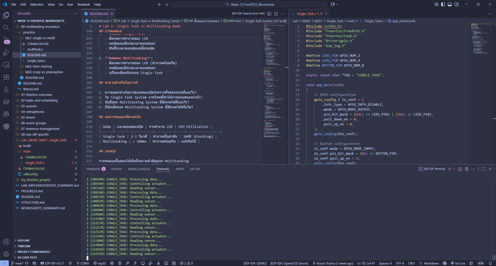

# Lab 1: Single Task vs Multitasking Demo

## วัตถุประสงค์
เปรียบเทียบระบบ Single Task กับ Multitasking เพื่อเข้าใจความแตกต่างในการตอบสนอง

## เวลาที่ใช้
45 นาที

## อุปกรณ์ที่ต้องใช้
- ESP32 Development Board
- LED 2 ดวง (หรือใช้ built-in LED)
- Push Button 1 ตัว
- Resistor 10kΩ
- Breadboard และสายจัมเปอร์

## ขั้นตอนการทดลอง

### Part 1: Single Task System (20 นาที)

สร้างโปรเจกต์ใหม่และเขียนโปรแกรม Single Task:

```c
#include <stdio.h>
#include "freertos/FreeRTOS.h"
#include "freertos/task.h"
#include "driver/gpio.h"
#include "esp_log.h"

#define LED1_PIN GPIO_NUM_2
#define LED2_PIN GPIO_NUM_4
#define BUTTON_PIN GPIO_NUM_0

static const char *TAG = "SINGLE_TASK";

void app_main(void)
{
    // GPIO Configuration
    gpio_config_t io_conf = {
        .intr_type = GPIO_INTR_DISABLE,
        .mode = GPIO_MODE_OUTPUT,
        .pin_bit_mask = (1ULL << LED1_PIN) | (1ULL << LED2_PIN),
        .pull_down_en = 0,
        .pull_up_en = 0,
    };
    gpio_config(&io_conf);

    // Button configuration
    io_conf.mode = GPIO_MODE_INPUT;
    io_conf.pin_bit_mask = 1ULL << BUTTON_PIN;
    io_conf.pull_up_en = 1;
    gpio_config(&io_conf);

    ESP_LOGI(TAG, "Single Task System Started");

    while (1) {
        // Task 1: Blink LED1 (simulated sensor reading)
        ESP_LOGI(TAG, "Reading sensor...");
        gpio_set_level(LED1_PIN, 1);
        vTaskDelay(pdMS_TO_TICKS(500)); // Simulate slow sensor
        gpio_set_level(LED1_PIN, 0);
        vTaskDelay(pdMS_TO_TICKS(500));

        // Task 2: Process data (heavy computation)
        ESP_LOGI(TAG, "Processing data...");
        for (int i = 0; i < 1000000; i++) {
            // Simulate heavy computation
            volatile int dummy = i * i;
        }

        // Task 3: Control LED2 (actuator)
        ESP_LOGI(TAG, "Controlling actuator...");
        gpio_set_level(LED2_PIN, 1);
        vTaskDelay(pdMS_TO_TICKS(300));
        gpio_set_level(LED2_PIN, 0);
        vTaskDelay(pdMS_TO_TICKS(300));

        // Task 4: Check button (emergency response)
        if (gpio_get_level(BUTTON_PIN) == 0) {
            ESP_LOGW(TAG, "Button pressed! (Delayed response)");
            // Response is delayed because other tasks run first
        }
    }
}
```

### Part 2: Multitasking System (20 นาที)

แปลงเป็น Multitasking system:

```c
#include <stdio.h>
#include "freertos/FreeRTOS.h"
#include "freertos/task.h"
#include "driver/gpio.h"
#include "esp_log.h"

#define LED1_PIN GPIO_NUM_2
#define LED2_PIN GPIO_NUM_4
#define BUTTON_PIN GPIO_NUM_0

static const char *TAG = "MULTITASK";

// Task 1: Sensor Reading
void sensor_task(void *pvParameters)
{
    while (1) {
        ESP_LOGI(TAG, "Reading sensor...");
        gpio_set_level(LED1_PIN, 1);
        vTaskDelay(pdMS_TO_TICKS(100));
        gpio_set_level(LED1_PIN, 0);
        vTaskDelay(pdMS_TO_TICKS(900)); // 1 second total
    }
}

// Task 2: Data Processing
void processing_task(void *pvParameters)
{
    while (1) {
        ESP_LOGI(TAG, "Processing data...");
        for (int i = 0; i < 500000; i++) {
            volatile int dummy = i * i;
            if (i % 100000 == 0) {
                vTaskDelay(1); // Yield to other tasks
            }
        }
        vTaskDelay(pdMS_TO_TICKS(500));
    }
}

// Task 3: Actuator Control
void actuator_task(void *pvParameters)
{
    while (1) {
        ESP_LOGI(TAG, "Controlling actuator...");
        gpio_set_level(LED2_PIN, 1);
        vTaskDelay(pdMS_TO_TICKS(200));
        gpio_set_level(LED2_PIN, 0);
        vTaskDelay(pdMS_TO_TICKS(800)); // 1 second total
    }
}

// Task 4: Emergency Response (High Priority)
void emergency_task(void *pvParameters)
{
    while (1) {
        if (gpio_get_level(BUTTON_PIN) == 0) {
            ESP_LOGW(TAG, "EMERGENCY! Button pressed - Immediate response!");
            // Immediate response because this task has high priority
            gpio_set_level(LED1_PIN, 1);
            gpio_set_level(LED2_PIN, 1);
            vTaskDelay(pdMS_TO_TICKS(100));
            gpio_set_level(LED1_PIN, 0);
            gpio_set_level(LED2_PIN, 0);
        }
        vTaskDelay(pdMS_TO_TICKS(10)); // Check every 10ms
    }
}

void app_main(void)
{
    // GPIO Configuration
    gpio_config_t io_conf = {
        .intr_type = GPIO_INTR_DISABLE,
        .mode = GPIO_MODE_OUTPUT,
        .pin_bit_mask = (1ULL << LED1_PIN) | (1ULL << LED2_PIN),
        .pull_down_en = 0,
        .pull_up_en = 0,
    };
    gpio_config(&io_conf);

    // Button configuration
    io_conf.mode = GPIO_MODE_INPUT;
    io_conf.pin_bit_mask = 1ULL << BUTTON_PIN;
    io_conf.pull_up_en = 1;
    gpio_config(&io_conf);

    ESP_LOGI(TAG, "Multitasking System Started");

    // Create tasks with different priorities
    xTaskCreate(sensor_task, "sensor", 2048, NULL, 2, NULL);
    xTaskCreate(processing_task, "processing", 2048, NULL, 1, NULL);
    xTaskCreate(actuator_task, "actuator", 2048, NULL, 2, NULL);
    xTaskCreate(emergency_task, "emergency", 2048, NULL, 5, NULL); // Highest priority
}
```

### Part 3: เปรียบเทียบและวิเคราะห์ (5 นาที)

## การทดสอบ

1. **ทดสอบ Single Task**:
   - สังเกตการทำงานของ LED
   - กดปุ่มและสังเกตเวลาตอบสนอง
   - บันทึกเวลาตอบสนองเมื่อกดปุ่ม
   

2. **ทดสอบ Multitasking**:
   - สังเกตการทำงานของ LED (ทำงานพร้อมกัน)
   - กดปุ่มและสังเกตเวลาตอบสนอง
   - เปรียบเทียบกับระบบ Single Task
   

## คำถามสำหรับวิเคราะห์

1. ความแตกต่างในการตอบสนองปุ่มระหว่างทั้งสองระบบคืออะไร?
    // ความแตกต่างหลักอยู่ที่ เวลาหน่วง ในการกดปุ่ม
2. ใน Single Task System งานไหนที่ทำให้การตอบสนองล่าช้า?
    //งานที่ทำให้ระบบ หน่วงมากที่สุดคือ “Processing data” การวนลูปนี้ใช้เวลานาน (CPU-bound) และไม่มี vTaskDelay() ภายใน ทำให้ไม่คืนเวลาให้ task อื่น ➜ ปุ่มจะไม่ถูกตรวจจนกว่าลูปนี้จะจบ
3. ข้อดีของ Multitasking System ที่สังเกตได้คืออะไร?
    // ตอบสนองเร็วกว่า งานทำพร้อมกันได้ 
4. มีข้อเสียของ Multitasking System ที่สังเกตได้หรือไม่?
    // ซับซ้อนกว่า ต้องจัดการหลาย task

## ผลการทดลองที่คาดหวัง

| ระบบ | เวลาตอบสนองปุ่ม | การทำงาน LED | CPU Utilization |
|------|-------------------|---------------|-----------------|
| Single Task | 2-3 วินาที | ทำงานเป็นลำดับ | 100% (blocking) |
| Multitasking | < 100ms | ทำงานพร้อมกัน | แบ้งกันใช้ |

## บทสรุป

การทดลองนี้แสดงให้เห็นถึงความสำคัญของ Multitasking ในการปรับปรุงการตอบสนองและประสิทธิภาพของระบบ โดยเฉพาะในสถานการณ์ที่ต้องการตอบสนองเหตุการณ์ฉุกเฉินอย่างรวดเร็ว