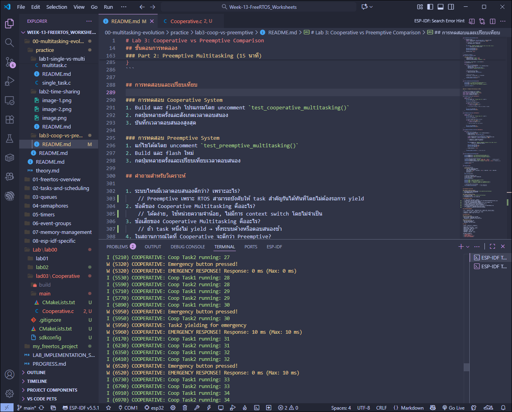
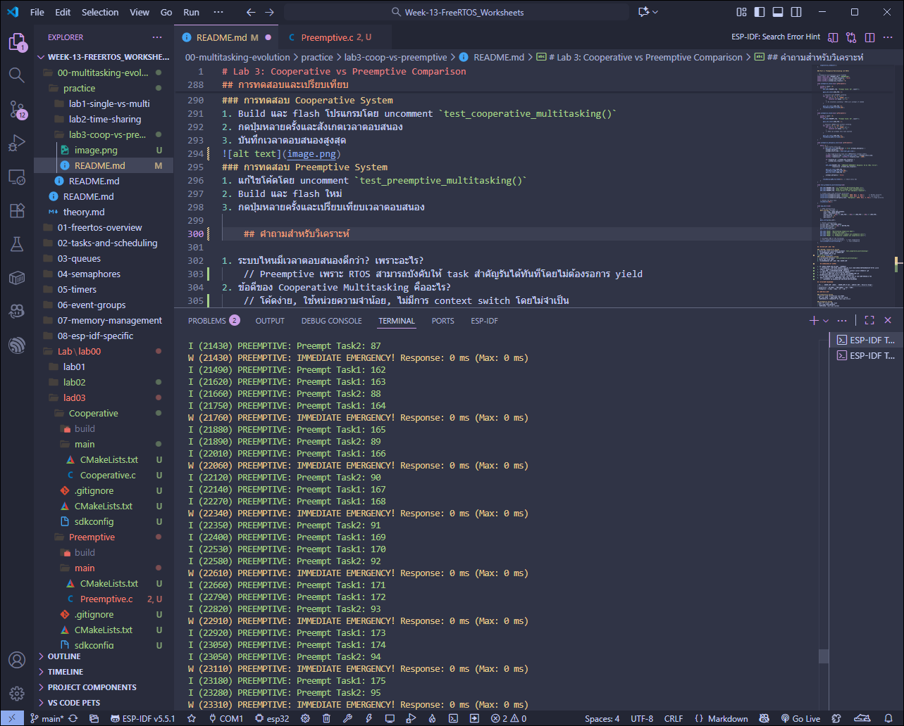

# Lab 3: Cooperative vs Preemptive Comparison

## วัตถุประสงค์
เปรียบเทียบ Cooperative Multitasking กับ Preemptive Multitasking และเข้าใจข้อดี-ข้อเสีย

## เวลาที่ใช้
30 นาที

## อุปกรณ์ที่ต้องใช้
- ESP32 Development Board
- LED 3 ดวง
- Push Button 1 ตัว

## ขั้นตอนการทดลอง

### Part 1: Cooperative Multitasking (15 นาที)

```c
#include <stdio.h>
#include "freertos/FreeRTOS.h"
#include "freertos/task.h"
#include "driver/gpio.h"
#include "esp_log.h"
#include "esp_timer.h"

#define LED1_PIN GPIO_NUM_2   // Task 1 indicator
#define LED2_PIN GPIO_NUM_4   // Task 2 indicator
#define LED3_PIN GPIO_NUM_5   // Task 3 indicator
#define BUTTON_PIN GPIO_NUM_0 // Emergency button

static const char *TAG = "COOPERATIVE";

// Global variables for cooperative scheduling
static volatile bool emergency_flag = false;
static uint64_t task_start_time = 0;
static uint32_t max_response_time = 0;

// Task structures for cooperative multitasking
typedef struct {
    void (*task_function)(void);
    const char* name;
    bool ready;
} coop_task_t;

// Cooperative task implementations
void cooperative_task1(void)
{
    static uint32_t count = 0;
    ESP_LOGI(TAG, "Coop Task1 running: %d", count++);
    
    gpio_set_level(LED1_PIN, 1);
    
    // Simulate work with voluntary yielding
    for (int i = 0; i < 5; i++) {
        // Do some work
        for (int j = 0; j < 50000; j++) {
            volatile int dummy = j * 2;
        }
        
        // Check for emergency and yield if needed
        if (emergency_flag) {
            ESP_LOGW(TAG, "Task1 yielding for emergency");
            gpio_set_level(LED1_PIN, 0);
            return; // Yield immediately
        }
        
        // Voluntary yield point
        vTaskDelay(1); // Minimal delay to yield
    }
    
    gpio_set_level(LED1_PIN, 0);
}

void cooperative_task2(void)
{
    static uint32_t count = 0;
    ESP_LOGI(TAG, "Coop Task2 running: %d", count++);
    
    gpio_set_level(LED2_PIN, 1);
    
    // Simulate longer work with yielding
    for (int i = 0; i < 10; i++) {
        for (int j = 0; j < 30000; j++) {
            volatile int dummy = j + i;
        }
        
        if (emergency_flag) {
            ESP_LOGW(TAG, "Task2 yielding for emergency");
            gpio_set_level(LED2_PIN, 0);
            return;
        }
        
        vTaskDelay(1);
    }
    
    gpio_set_level(LED2_PIN, 0);
}

void cooperative_task3_emergency(void)
{
    if (emergency_flag) {
        uint64_t response_time = esp_timer_get_time() - task_start_time;
        uint32_t response_ms = (uint32_t)(response_time / 1000);
        
        if (response_ms > max_response_time) {
            max_response_time = response_ms;
        }
        
        ESP_LOGW(TAG, "EMERGENCY RESPONSE! Response time: %d ms (Max: %d ms)", 
                 response_ms, max_response_time);
        
        gpio_set_level(LED3_PIN, 1);
        vTaskDelay(pdMS_TO_TICKS(200));
        gpio_set_level(LED3_PIN, 0);
        
        emergency_flag = false;
    }
}

// Cooperative scheduler
void cooperative_scheduler(void)
{
    coop_task_t tasks[] = {
        {cooperative_task1, "Task1", true},
        {cooperative_task2, "Task2", true},
        {cooperative_task3_emergency, "Emergency", true}
    };
    
    int num_tasks = sizeof(tasks) / sizeof(tasks[0]);
    int current_task = 0;
    
    while (1) {
        // Check for emergency button
        if (gpio_get_level(BUTTON_PIN) == 0 && !emergency_flag) {
            emergency_flag = true;
            task_start_time = esp_timer_get_time();
            ESP_LOGW(TAG, "Emergency button pressed!");
        }
        
        // Run current task if ready
        if (tasks[current_task].ready) {
            tasks[current_task].task_function();
        }
        
        // Move to next task
        current_task = (current_task + 1) % num_tasks;
        
        // Small delay to prevent watchdog
        vTaskDelay(pdMS_TO_TICKS(10));
    }
}

void test_cooperative_multitasking(void)
{
    ESP_LOGI(TAG, "=== Cooperative Multitasking Demo ===");
    ESP_LOGI(TAG, "Tasks will yield voluntarily");
    ESP_LOGI(TAG, "Press button to test emergency response");
    
    cooperative_scheduler();
}
```

### Part 2: Preemptive Multitasking (15 นาที)

```c
// Preemptive multitasking using FreeRTOS
static const char *PREEMPT_TAG = "PREEMPTIVE";
static volatile bool preempt_emergency = false;
static uint64_t preempt_start_time = 0;
static uint32_t preempt_max_response = 0;

void preemptive_task1(void *pvParameters)
{
    uint32_t count = 0;
    while (1) {
        ESP_LOGI(PREEMPT_TAG, "Preempt Task1: %d", count++);
        
        gpio_set_level(LED1_PIN, 1);
        
        // Simulate work WITHOUT yielding
        for (int i = 0; i < 5; i++) {
            for (int j = 0; j < 50000; j++) {
                volatile int dummy = j * 2;
            }
            // No voluntary yielding - RTOS will preempt if needed
        }
        
        gpio_set_level(LED1_PIN, 0);
        vTaskDelay(pdMS_TO_TICKS(100));
    }
}

void preemptive_task2(void *pvParameters)
{
    uint32_t count = 0;
    while (1) {
        ESP_LOGI(PREEMPT_TAG, "Preempt Task2: %d", count++);
        
        gpio_set_level(LED2_PIN, 1);
        
        // Simulate LONGER work without yielding
        for (int i = 0; i < 20; i++) {
            for (int j = 0; j < 30000; j++) {
                volatile int dummy = j + i;
            }
            // RTOS can preempt this task anytime
        }
        
        gpio_set_level(LED2_PIN, 0);
        vTaskDelay(pdMS_TO_TICKS(150));
    }
}

void preemptive_emergency_task(void *pvParameters)
{
    while (1) {
        // Check button every 5ms
        if (gpio_get_level(BUTTON_PIN) == 0 && !preempt_emergency) {
            preempt_emergency = true;
            preempt_start_time = esp_timer_get_time();
            
            // This high-priority task will IMMEDIATELY preempt others
            uint64_t response_time = esp_timer_get_time() - preempt_start_time;
            uint32_t response_ms = (uint32_t)(response_time / 1000);
            
            if (response_ms > preempt_max_response) {
                preempt_max_response = response_ms;
            }
            
            ESP_LOGW(PREEMPT_TAG, "IMMEDIATE EMERGENCY! Response: %d ms (Max: %d ms)", 
                     response_ms, preempt_max_response);
            
            gpio_set_level(LED3_PIN, 1);
            vTaskDelay(pdMS_TO_TICKS(200));
            gpio_set_level(LED3_PIN, 0);
            
            preempt_emergency = false;
        }
        
        vTaskDelay(pdMS_TO_TICKS(5)); // Check every 5ms
    }
}

void test_preemptive_multitasking(void)
{
    ESP_LOGI(PREEMPT_TAG, "=== Preemptive Multitasking Demo ===");
    ESP_LOGI(PREEMPT_TAG, "RTOS will preempt tasks automatically");
    ESP_LOGI(PREEMPT_TAG, "Press button to test emergency response");
    
    // Create tasks with different priorities
    xTaskCreate(preemptive_task1, "PreTask1", 2048, NULL, 2, NULL);      // Normal priority
    xTaskCreate(preemptive_task2, "PreTask2", 2048, NULL, 1, NULL);      // Low priority
    xTaskCreate(preemptive_emergency_task, "Emergency", 2048, NULL, 5, NULL); // High priority
    
    // Delete the main task
    vTaskDelete(NULL);
}

void app_main(void)
{
    // GPIO Configuration
    gpio_config_t io_conf = {
        .intr_type = GPIO_INTR_DISABLE,
        .mode = GPIO_MODE_OUTPUT,
        .pin_bit_mask = (1ULL << LED1_PIN) | (1ULL << LED2_PIN) | (1ULL << LED3_PIN),
        .pull_down_en = 0,
        .pull_up_en = 0,
    };
    gpio_config(&io_conf);

    // Button configuration
    io_conf.mode = GPIO_MODE_INPUT;
    io_conf.pin_bit_mask = 1ULL << BUTTON_PIN;
    io_conf.pull_up_en = 1;
    gpio_config(&io_conf);

    ESP_LOGI("MAIN", "Multitasking Comparison Demo");
    ESP_LOGI("MAIN", "Choose test mode:");
    ESP_LOGI("MAIN", "1. Cooperative (comment out preemptive call)");
    ESP_LOGI("MAIN", "2. Preemptive (comment out cooperative call)");
    
    // Uncomment ONE of the following:
    // test_cooperative_multitasking();  // Test cooperative
    test_preemptive_multitasking();       // Test preemptive
}
```

## การทดสอบและเปรียบเทียบ

### การทดสอบ Cooperative System
1. Build และ flash โปรแกรมโดย uncomment `test_cooperative_multitasking()`
2. กดปุ่มหลายครั้งและสังเกตเวลาตอบสนอง
3. บันทึกเวลาตอบสนองสูงสุด

### การทดสอบ Preemptive System
1. แก้ไขโค้ดโดย uncomment `test_preemptive_multitasking()`
2. Build และ flash ใหม่
3. กดปุ่มหลายครั้งและเปรียบเทียบเวลาตอบสนอง

    ## คำถามสำหรับวิเคราะห์

1. ระบบไหนมีเวลาตอบสนองดีกว่า? เพราะอะไร?
    // Preemptive เพราะ RTOS สามารถบังคับให้ task สำคัญรันได้ทันทีโดยไม่ต้องรอการ yield
2. ข้อดีของ Cooperative Multitasking คืออะไร?
    // โค้ดง่าย, ใช้หน่วยความจำน้อย, ไม่มีการ context switch โดยไม่จำเป็น
3. ข้อเสียของ Cooperative Multitasking คืออะไร?
    // ถ้า task หนึ่งไม่ yield → ทั้งระบบค้างหรือตอบสนองช้า
4. ในสถานการณ์ใดที่ Cooperative จะดีกว่า Preemptive?
    // งานง่ายๆ ที่ไม่ต้องการ real-time เช่น ระบบแสดงผล LED หรืองานลำดับคงที่
5. เหตุใด Preemptive จึงเหมาะสำหรับ Real-time systems?
    // เพราะสามารถ ควบคุมลำดับและเวลาการตอบสนองได้แน่นอน

## ผลการทดลองที่คาดหวัง

| ระบบ | เวลาตอบสนองเฉลี่ย | เวลาตอบสนองสูงสุด | ความซับซ้อน | Resource Usage |
|------|-------------------|------------------|-------------|----------------|
| Cooperative | 50-200ms | 500-1000ms | ต่ำ | น้อย |
| Preemptive | 5-20ms | 50ms | สูง | มาก |

## สถานการณ์จำลอง

### Cooperative System
- Task จะ "ใจดี" ยกสิทธิ์ให้ task อื่น
- หาก task หนึ่ง "เห็นแก่ตัว" ทั้งระบบจะช้า
- เหมาะสำหรับระบบที่ไม่ต้องการ real-time strict

### Preemptive System  
- RTOS จะ "บังคับ" สลับ task
- Task สำคัญจะได้รันทันที
- เหมาะสำหรับ real-time systems

## บทสรุป

| ลักษณะ | Cooperative | Preemptive |
|--------|-------------|------------|
| ความซับซ้อน | ต่ำ | สูง |
| Response Time | ไม่แน่นอน | แน่นอน |
| Resource Usage | น้อย | มาก |
| Determinism | ไม่มี | มี |
| Development | ง่าย | ยาก |
| Debugging | ง่าย | ยาก |
| Real-time | ไม่เหมาะ | เหมาะ |

การเลือกใช้ขึ้นอยู่กับ:
- **ข้อกำหนด Real-time**
- **ทรัพยากรที่มี**  
- **ความซับซ้อนที่ยอมรับได้**
- **ประสบการณ์ของทีมพัฒนา**